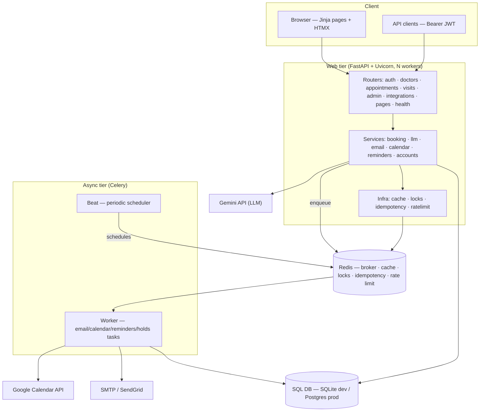
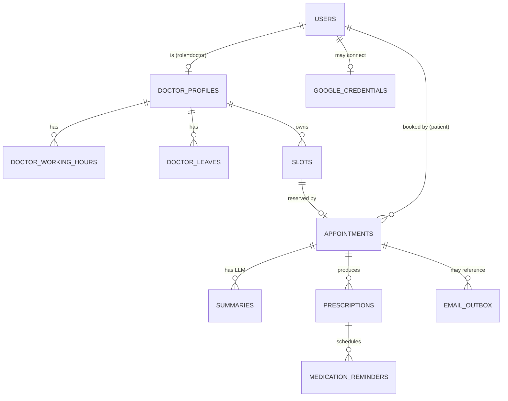
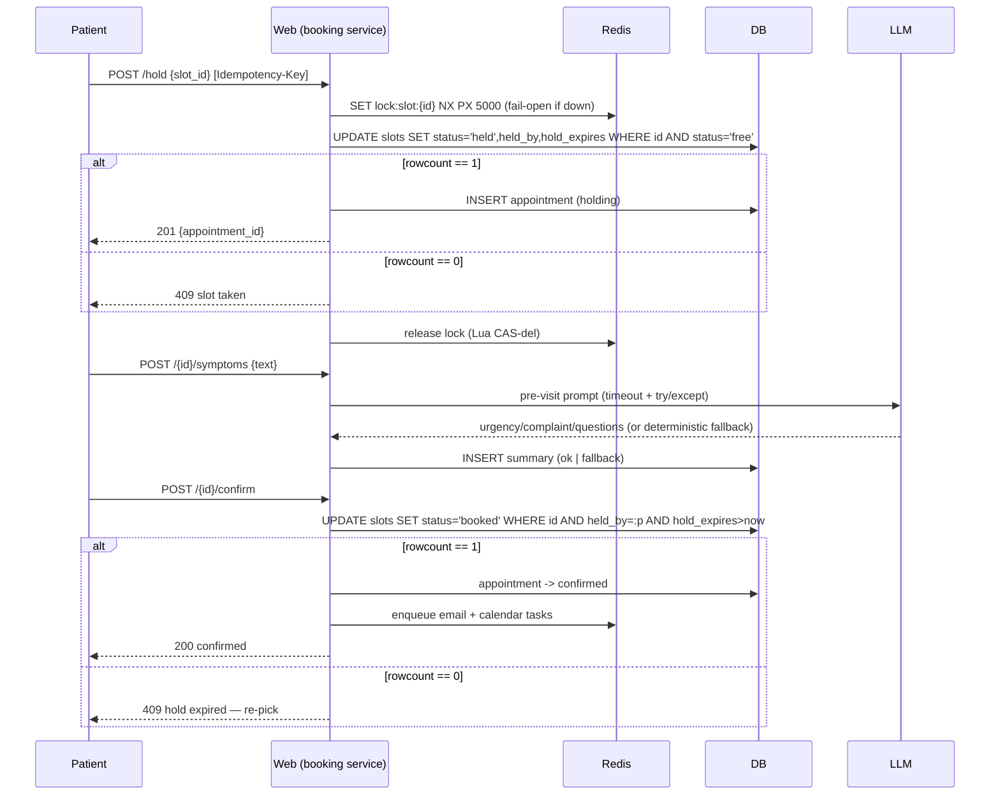

# ARCHITECTURE.md — Healthcare Appointment & Follow-up Manager

A senior-level deep-dive into the system: components, data model, request and
async flows, the concurrency proof, caching, failure modes, scaling, security,
observability, and the trade-offs behind each decision. For the tight ≤800-word
summary of the four graded problems, see [DESIGN.md](DESIGN.md).

---

## 1. Component overview

One codebase runs as three process roles (web / worker / beat) plus Redis and a
SQL database. The web tier serves both the JSON API and the Jinja+HTMX pages —
a single deployable service, no separate SPA.



Every dependency outside the DB is optional at runtime: Redis, the LLM, email
and calendar all have graceful fallbacks (see §6), so the same code runs with
zero external infrastructure locally and at full topology in production.

## 2. Layering

```
routers/      HTTP + validation + RBAC + CSRF; no business logic
services/     domain logic (booking, llm, email, calendar, reminders, accounts)
infra/        cross-cutting Redis helpers (cache, locks, idempotency, ratelimit)
models.py     SQLAlchemy 2.0 ORM (Mapped/mapped_column)
database.py   engine + SessionLocal + Base + portable UTCDateTime, built from DATABASE_URL
tasks/        thin Celery wrappers that call services/
```

Routers stay thin; all invariants live in `services/booking.py` so they hold
regardless of whether a call arrives via API, an HTMX page post, or a Celery
task.

## 3. Data model



Key design points:

- **`slots` vs `appointments`** — inventory/concurrency separated from clinical
  record (see §5). `slots` carries `status`, `held_by`, `hold_expires_at`,
  `version`; `appointments` carries symptoms, notes, summaries, event IDs.
- **Unique constraints as invariants:** `slots(doctor_id, start_time)`,
  `appointments(slot_id)`, `doctor_leaves(doctor_id, leave_date)`,
  `email_outbox(dedupe_key)`, `medication_reminders(prescription_id,
  scheduled_at)` — each one makes an otherwise-racy operation idempotent.
- **Portability:** only portable column types; a custom `UTCDateTime`
  TypeDecorator stores tz-aware UTC on both SQLite and Postgres. No PG-only DDL,
  so SQLite tests exercise the same schema and the same code paths.
- **All timestamps are UTC** in the DB; working hours are interpreted in
  `CLINIC_TZ` via `zoneinfo` (DST-safe) only at slot-generation time.

## 4. Booking flow (two-phase hold)



## 5. Concurrency proof (why double-booking is impossible)

The reservation is a single conditional UPDATE:

```sql
UPDATE slots
   SET status='held', held_by=:p, hold_expires_at=:exp, version=version+1
 WHERE id=:id AND status='free';
```

- The database guarantees **row-level atomicity**: concurrent UPDATEs to the same
  row serialize. The row's `status` can equal `'free'` for exactly one of them;
  every other UPDATE sees `status='held'` and matches zero rows.
- `rowcount == 1` is therefore a **mutually-exclusive winner signal** — no read,
  compare, or second statement is involved, so there is no TOCTOU window.
- This holds on **both** SQLite (single-writer) and Postgres (row locks under
  `READ COMMITTED`) with **no `SELECT ... FOR UPDATE`** — the code is identical.
- **L1 Redis lock** only reduces wasted work under bursts (fast pre-rejection);
  it is never the guarantee and fails open.
- **L3 unique `(doctor_id, start_time)`** is the structural backstop.

Confirm / cancel / reschedule / expiry reuse the same pattern with different
`WHERE` guards, so every transition is race-safe by construction. Full analysis
of hold, confirm, leave, and outbox lives in [DESIGN.md](DESIGN.md).

## 6. Failure modes & degradation

| Dependency | Failure | Behaviour | Recovery |
|---|---|---|---|
| **LLM (Gemini)** | no key / timeout / API error / bad schema | Deterministic keyword urgency + templated summary; stored `status='fallback'` | Automatic next call; booking never blocked |
| **Email** | SMTP/provider down | Outbox row stays `pending`/`failed`, retried with backoff; `dead` after `max_attempts` | Beat sweep re-drives; `dedupe_key` prevents dupes |
| **Calendar** | OAuth unconfigured/revoked | Logged no-op / mark disconnected; surfaced to user | Reconnect via OAuth; task retried |
| **Redis** | down | Cache no-op (DB fallback), lock fails open, rate-limit fails open, idempotency no-op | CAS + unique indexes keep correctness |
| **Celery broker** | down | Eager mode runs inline; or tasks queue when broker returns | `broker_connection_retry_on_startup` |
| **Web worker crash** | mid-hold | Hold expires via Beat sweep → slot returns to `free` | 60s expiry job |

The invariant: **loss of any non-DB dependency degrades a feature, never the
core booking correctness.**

## 7. Async & scheduled work (Celery)

Task modules: `tasks/email.py`, `tasks/calendar.py`, `tasks/reminders.py`,
`tasks/holds.py`. Beat schedule (from `app/celery_app.py`):

| Job | Task | Cadence | Purpose |
|---|---|---|---|
| Expire stale holds | `holds.expire` | 60s | Return abandoned `held` slots to `free`, appt→`expired` |
| Sweep email outbox | `email.sweep` | 120s | Re-drive `pending`/`failed` outbox rows |
| Medication reminders | `reminders.medications` | 60s | Dispatch due medication reminders |
| Appointment reminders | `reminders.appointments` | 300s | Upcoming-visit reminders |
| Generate slot window | `slots.generate` | daily 02:15 UTC | Roll the `SLOT_WINDOW_DAYS` horizon forward |

Celery is configured `acks_late` + `reject_on_worker_lost` + `prefetch=1` so a
worker crash re-queues rather than drops a task; `worker_max_tasks_per_child`
caps memory creep.

## 8. Caching (cache-aside + versioned invalidation)

Doctor search, doctor profile+hours, and available-slot lists are cached with a
per-doctor **version counter** embedded in the key. Any booking/cancel/leave/
hours change calls `bump_doctor_version`, which atomically invalidates every
derived key in **O(1)** without key scanning. Short TTLs are a backstop. All
cache reads/writes are wrapped so a Redis outage falls through to the DB
transparently — correctness never depends on the cache.

## 9. Scaling & capacity

- **Web tier is stateless** → scale horizontally (more uvicorn workers /
  replicas behind a load balancer). Because the booking guarantee is a DB CAS
  and *not* an in-process or single-Redis lock, adding web replicas needs no
  coordination.
- **Workers scale horizontally**; **Beat is a singleton** (one scheduler) — the
  standard Celery topology.
- **DB is the source of truth and the scaling pinch point.** Availability reads
  are served from cache; writes are single-row CAS (cheap). Read replicas can
  absorb availability reads if needed; the write path stays on primary.
- **Redis** can be scaled/replicated independently; losing it degrades speed,
  not correctness.
- Hot paths are indexed: `slots(doctor_id, start_time)` for availability,
  `slots(status, hold_expires_at)` for the expiry sweep,
  `email_outbox(status, scheduled_at)` for the outbox sweep.

## 10. Security

- **AuthN:** JWT (PyJWT, HS256). Browser pages use an **httpOnly cookie**; API
  clients use `Authorization: Bearer`. Passwords hashed with **bcrypt**.
- **AuthZ:** `require_role(...)` dependency enforces patient/doctor/admin RBAC;
  admin routes carry a router-level guard.
- **CSRF:** double-submit token on cookie-authenticated form posts. **Bearer
  requests are CSRF-exempt** (no ambient cookie to abuse) — this is why API and
  tests use Bearer.
- **Secrets at rest:** Google OAuth **refresh tokens are Fernet-encrypted**; the
  Fernet key derives from `SECRET_KEY` when unset so the app runs out-of-the-box,
  and is set explicitly in production. No secrets are committed — everything is
  env-driven (`.env.example` documents every key with safe defaults).
- **Abuse controls:** Redis token-bucket **rate limiting** on login/register/
  booking (fails open if Redis is down).
- **Input validation** via Pydantic v2 schemas at the router boundary.

## 11. Observability

- **Structured JSON logging** with a per-request **correlation ID**
  (`X-Request-ID`, generated if absent and echoed back), plus method/path/status/
  duration on every request.
- **Health endpoints:** `/healthz` (liveness) and `/readyz` (readiness — checks
  DB and Redis) for container orchestration and load-balancer probes.
- LLM calls persist `provider`, `model`, `prompt`, `raw_output`, `latency_ms`,
  and `status` per summary — a full audit trail of every AI output.

## 12. Trade-offs & alternatives considered

| Decision | Chosen | Alternatives | Why |
|---|---|---|---|
| Double-booking | Lock-free CAS on `slots` | `SELECT FOR UPDATE`; PG advisory locks; `SERIALIZABLE` | CAS is DB-agnostic (works on SQLite tests *and* Postgres), needs no long transaction, and the row-count is a clean verdict. FOR UPDATE is Postgres-centric and holds locks; advisory locks are PG-only; SERIALIZABLE adds retry complexity. |
| Availability | Materialized `slots` rows | Compute free times on the fly from working hours | A row per slot gives a natural CAS target, an audit trail, and O(1) unique-constraint idempotency. Pure computation has no lockable unit. |
| Booking UX | Two-phase hold | Immediate atomic book | A hold reserves the slot while the patient fills symptoms + reviews the AI summary, so they never lose it mid-flow; Beat expiry reclaims abandonment. |
| Notifications | Persist-then-send outbox | Send inline in the request | Durable, retryable, dedupe-keyed, at-least-once — survives provider outages and never blocks the request. |
| LLM | Provider protocol + deterministic fallback | Hard-depend on one vendor | Swap Gemini↔Anthropic via config; the app is correct even with no key. |
| Frontend | Jinja + HTMX, one service | Separate SPA | Fewer moving parts, no CORS/build pipeline, server-rendered clinical UI; HTMX gives the interactive slot/hold/summary flows. |
| Migrations | Alembic + single `DATABASE_URL` | Separate schemas per engine | One schema definition, `render_as_batch` for SQLite ALTERs, identical models across dev and prod. |

## 13. Local vs. production topology

- **Zero-infra (dev/tests):** SQLite + `CELERY_TASK_ALWAYS_EAGER=true` (tasks run
  inline) + cache/lock/rate-limit no-op when Redis is absent + LLM fallback +
  console email. One `uvicorn` process; `pytest` runs the full suite on SQLite.
- **Full topology (`docker-compose up`):** Postgres + Redis + web (migrate → seed
  → uvicorn) + Celery worker + Celery beat. Set `GEMINI_API_KEY`, real
  `EMAIL_BACKEND`, and Google OAuth to light up live LLM, email and calendar.

The switch between them is entirely configuration — no code changes.
